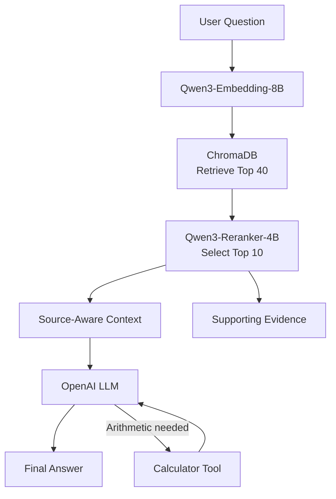

# ResearchPilot

**ResearchPilot** is a production-oriented Retrieval-Augmented Generation (RAG) system for querying, comparing, and reasoning over corporate annual reports.

It combines dense retrieval, neural reranking, source-aware multi-document reasoning, calculator tool use, evidence display, systematic evaluation, and GPU-backed deployment.

The current knowledge base contains FY2026 annual-report data for **Infosys, TCS, and ITC**.

---

## Live Demo

**Try ResearchPilot:** [Launch the live application](https://saxenajay3155--researchpilot-ui.modal.run)

> The app is deployed on GPU-backed Modal infrastructure and scales down when idle.  
> Because of this, the first load after inactivity may take a little longer while compute resources are started and the models are loaded.

---

## Key Features

- **Qwen3-Embedding-8B** for dense semantic retrieval
- **ChromaDB** persistent vector store
- **Top-40 candidate retrieval**
- **Qwen3-Reranker-4B** cross-encoder reranking to a final Top-10
- **Source-aware context preparation** to reduce cross-company attribution errors
- **Conservative company filtering** for clearly single-company questions
- **Calculator tool calling** for differences, percentages, ratios, and growth calculations
- **OpenAI LLM** for grounded answer generation
- **Gradio UI** with final answers and supporting evidence
- **Evidence-level retrieval evaluation**
- **Answer-level evaluation** for correctness, groundedness, and completeness
- **Modal deployment** using the validated dual-GPU layout
- Failure-analysis-driven iteration with measured before/after results

---

## Architecture



### How it works

1. The user question is embedded using **Qwen3-Embedding-8B**.
2. ChromaDB retrieves the **Top 40** candidate passages.
3. **Qwen3-Reranker-4B** reranks those candidates and keeps the **Top 10**.
4. Source metadata is preserved and added to the final context.
5. The LLM generates an answer from the retrieved evidence.
6. If arithmetic is required, the LLM can call a restricted calculator tool.
7. The UI separately displays the final answer and supporting evidence.

---

## Why Top-40 Retrieval + Top-10 Reranking?

Dense retrieval performed best as a high-recall candidate generator.

Increasing retrieval depth substantially improved evidence coverage, while early-rank quality changed much less. This indicated that the required evidence was often present in the candidate pool but not ranked strongly enough.

The final design therefore separates the two goals:

```text
Embedding model
→ maximize candidate recall

Reranker
→ improve final evidence precision and ordering
```

This gives the system a stronger final context without sending all 40 retrieved passages to the answer model.

---

## Evaluation

ResearchPilot uses a **78-question golden dataset** containing expected answers, source documents, evidence passages, category labels, difficulty, and reasoning hops.

The benchmark covers:

- basic retrieval
- multi-hop reasoning
- numerical financial questions
- qualitative risk questions
- temporal trends
- cross-document comparisons

Retrieval quality and answer quality are evaluated separately because they fail for different reasons.

---

## Final Retrieval Evaluation

| Metric | Score |
|---|---:|
| MRR@10 | **0.7673** |
| Hit@10 | **0.8974** |
| Evidence Recall@10 | **0.8590** |
| Full Coverage@10 | **0.8205** |
| Project nDCG@10 | **0.7901** |

> **Note:** `Project nDCG` preserves the project's historical evaluation definition for experiment comparability. Evidence Recall and Full Coverage separately measure missing evidence.

---

## Final Answer Evaluation

Each generated answer was scored on **Correctness**, **Groundedness**, and **Completeness**.

### Final results

| Metric | Score |
|---|---:|
| Correctness | **90.38%** |
| Groundedness | **89.10%** |
| Completeness | **83.97%** |
| Overall | **87.82%** |
| Strict Pass Rate | **70.51%** |

### Performance by category

| Category | Overall |
|---|---:|
| Numerical Financial | **100.00%** |
| Multi-Hop | **95.83%** |
| Basic Retrieval | **95.56%** |
| Temporal Trend | **90.74%** |
| Risk Qualitative | **80.56%** |
| Cross-Document | **71.30%** |

---

## Failure Analysis: 78.21% → 87.82%

The first end-to-end evaluation exposed a systematic **source-attribution problem**.

In several failures, the retriever had already found the correct evidence, but the answer model assigned a nearby figure from another company's report to the wrong company.

Example:

```text
Question:
What was Infosys' consolidated revenue in FY2026?

Retrieved Rank 1:
Infosys → ₹1,78,650 crore

Retrieved Rank 2:
TCS → ₹2,67,021 crore

Incorrect generated answer:
₹2,67,021 crore
```

The retrieval layer was working. The generation layer was losing source identity.

### Fix

The pipeline was changed to:

- preserve metadata through reranking,
- explicitly label each passage with its company and source,
- filter to the requested company only when the query is clearly single-company,
- keep all sources for comparative or ambiguous questions.

### Measured impact

| Metric | Before | After |
|---|---:|---:|
| Correctness | 80.13% | **90.38%** |
| Groundedness | 79.49% | **89.10%** |
| Completeness | 75.00% | **83.97%** |
| Overall | 78.21% | **87.82%** |
| Cross-Document Overall | 44.44% | **71.30%** |

> **Retrieving the correct evidence is not enough if the generation layer cannot reliably preserve source identity.**

---

## Source-Aware Context

After reranking, passages are formatted with explicit company and source labels before being sent to the LLM.

Example:

```text
### Passage 1

Company: Infosys
Source: Infosys-ar-26

Revenues FY2026: ₹1,78,650 crore
```

For clearly single-company questions, irrelevant companies can be removed from the final context.

For comparative or ambiguous questions, the system keeps multi-company evidence.

The filtering rule is intentionally conservative: when intent is ambiguous, evidence is not removed.

---

## Calculator Tool

Financial questions often require arithmetic rather than direct extraction.

ResearchPilot includes a restricted calculator built using Python's `ast` module instead of unrestricted `eval()`.

Supported operations:

```text
+
-
*
/
**
%
parentheses
unary +/-
```

The tool supports calculations such as:

- absolute differences
- percentage increases
- growth rates
- ratios

It also includes thousands-separator normalization, graceful handling of invalid expressions, and a maximum tool-call round limit.

Tool messages remain internal. The user sees only the final answer.

---

## Example Questions

```text
What was Infosys' consolidated revenue in FY2026?
```

```text
Which company reported the higher FY2026 EPS, Infosys or TCS,
and what was the difference?
```

```text
How did the FY2026 large-deal/contract-value figures of
TCS and Infosys compare?
```

```text
How much higher was Infosys' FY2026 net profit than FY2025,
and what percentage increase does that represent?
```

**[Try them in the live demo](https://saxenajay3155--researchpilot-ui.modal.run)**

---

## Project Structure

```text
researchpilot/
│
├── evaluation/                 # Retrieval evaluation code/results
├── knowledge_base/             # Annual-report Markdown corpus
│
├── app.py                      # Gradio application
├── config.py                   # Models, K values, devices, paths
├── retrieval.py                # Retrieval, reranking and answer pipeline
├── tools.py                    # Safe calculator tool
├── modal_app.py                # Modal deployment configuration
│
├── golden_dataset.jsonl        # 78-question evaluation dataset
├── final_answer_evaluation_v2.csv
│
├── requirements.txt
├── .gitignore
└── README.md
```

The local Chroma vector database is intentionally excluded from Git tracking and is stored separately for deployment.

---

## Models and Stack

| Component | Technology |
|---|---|
| Embeddings | `Qwen/Qwen3-Embedding-8B` |
| Reranker | `Qwen/Qwen3-Reranker-4B` |
| Answer generation | `gpt-4.1-mini-2025-04-14` |
| Vector database | ChromaDB |
| Tool calling | LangChain |
| UI | Gradio |
| Evaluation | Custom evidence matching + LLM judge |
| Deployment | Modal |

The embedding model is loaded in **8-bit quantized form**.

The deployed application uses the same validated dual-GPU layout as development:

```text
cuda:0 → Qwen3-Embedding-8B
cuda:1 → Qwen3-Reranker-4B
```

Modal stores the vector database and Hugging Face model cache in persistent volumes, while the app scales down when idle.

---

## Getting Started

### 1. Clone the repository

```bash
git clone https://github.com/saxenajay3155/researchpilot.git
cd researchpilot
```

### 2. Create a virtual environment

Windows:

```bash
python -m venv .venv
.venv\Scripts\activate
```

Linux/macOS:

```bash
python -m venv .venv
source .venv/bin/activate
```

### 3. Install dependencies

```bash
pip install -r requirements.txt
```

### 4. Configure secrets

Create a local `.env` file:

```env
OPENAI_API_KEY=your_openai_api_key
HF_TOKEN=your_huggingface_token
```

`.env` is excluded through `.gitignore` and should never be committed.

### 5. Add the vector database

The vector database is not stored in Git.

Place it so the local structure matches the path configured in `config.py`:

```text
researchpilot/
└── vector_db_qwen_750/
    └── vector_db_qwen/
        ├── chroma.sqlite3
        └── ...
```

### 6. Run the application locally

```bash
python app.py
```

Open the Gradio URL shown in the terminal.

---

## Evaluation Files

### Retrieval evaluation

The retrieval evaluator measures:

- MRR
- Hit Rate
- Evidence Recall
- Full Coverage
- project nDCG
- first relevant evidence rank
- category performance
- difficulty performance
- hop-level performance

### Answer evaluation

`final_answer_evaluation_v2.csv` stores per-question:

- expected answer
- generated answer
- correctness
- groundedness
- completeness
- overall score
- judge reasoning

This keeps the headline evaluation metrics traceable back to individual examples.

---

## Known Limitations

- **Cross-document reasoning remains the weakest evaluated category**, although it improved substantially after source-aware changes.
- Some annual-report metrics have similar names but different accounting definitions, so comparisons require careful metric attribution.
- The current architecture is GPU-heavy because it uses an 8B embedding model and a 4B reranker.
- The vector database is stored separately rather than rebuilt automatically from the source corpus.
- The current system focuses on three FY2026 annual reports rather than arbitrary document upload.
- LLM-based answer evaluation is useful for system-level benchmarking but does not replace human review.

---

## Engineering Decisions

### Why raw ChromaDB?

The retrieval layer uses direct Chroma queries to retain explicit control over documents, metadata, distances, and batched query embeddings.

### Why a reranker?

Dense retrieval at larger `K` substantially improved evidence coverage. Relevant passages often existed in the candidate pool but needed stronger relevance scoring before being sent to the LLM.

A cross-encoder reranker was therefore added between retrieval and generation.

### Why source-aware filtering?

Evaluation demonstrated that the answer model could misuse correct evidence even when retrieval succeeded.

Deterministic source constraints are therefore applied when confidence is high instead of delegating every source-selection decision to the LLM.

### Why keep filtering conservative?

A query can be comparative without explicitly naming every company.

For example:

```text
Which company had the highest revenue in FY2025?
```

contains no company name but clearly requires multi-company evidence.

The system therefore filters only when the query is clearly single-company. Otherwise, it keeps the complete reranked evidence set.

### Why evaluate retrieval and generation separately?

They answer different questions:

```text
Retrieval evaluation
→ Did the system find the evidence?

Answer evaluation
→ Did the model use the evidence correctly?
```

Separating the two made it possible to identify that the most important failure was in source attribution rather than retrieval itself.
